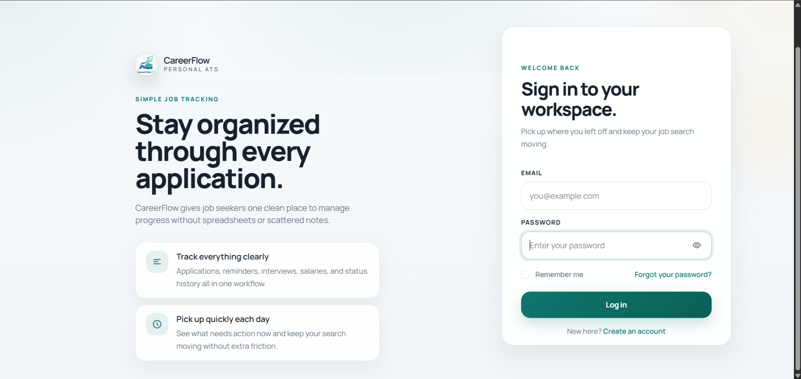
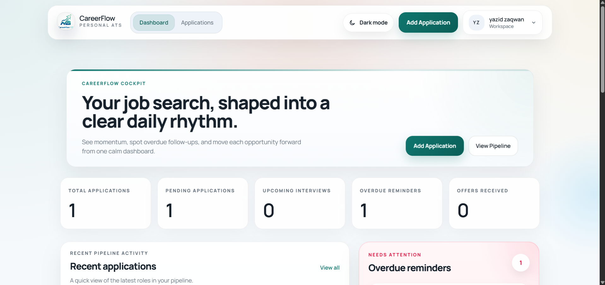
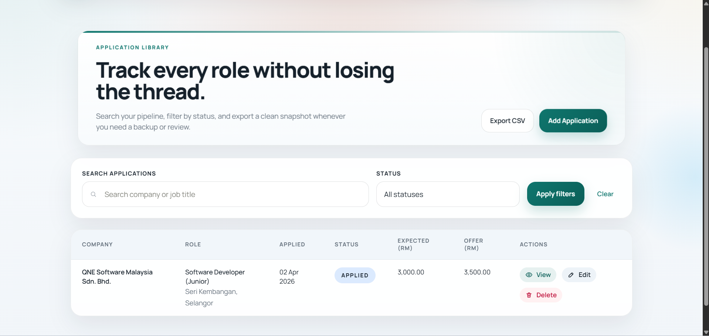
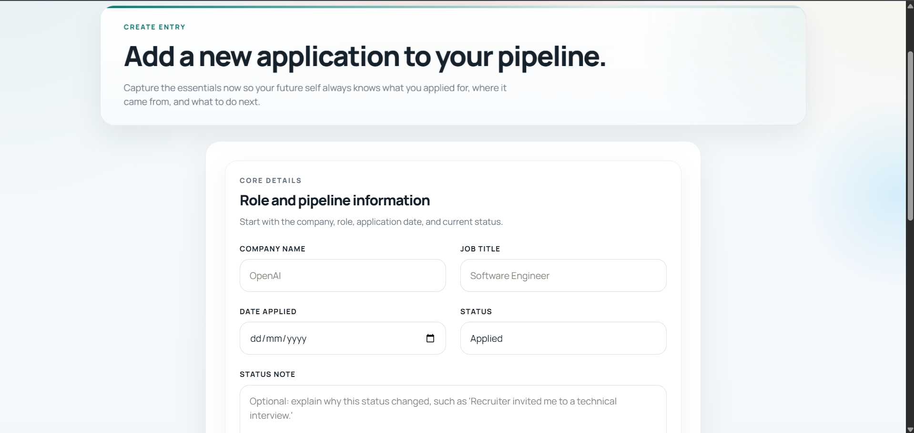
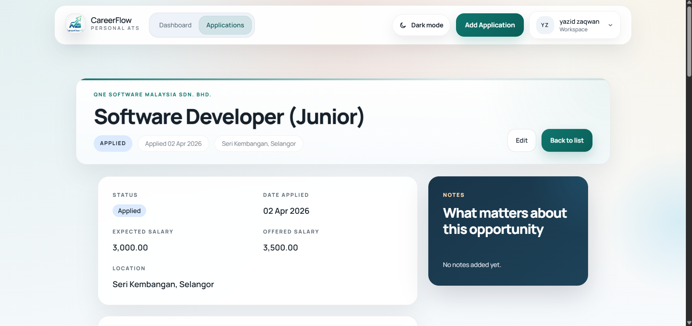
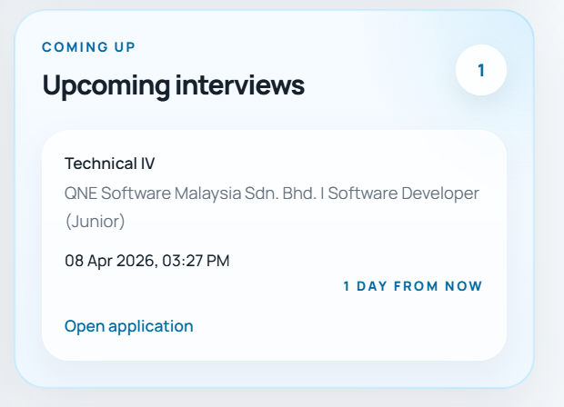
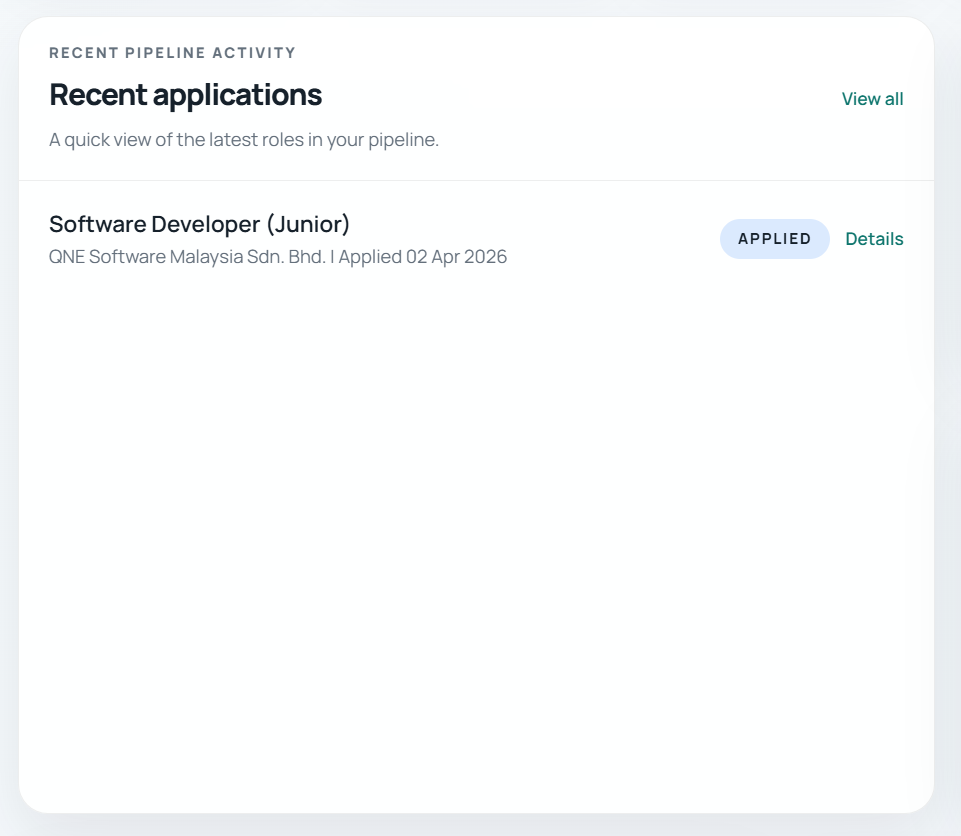
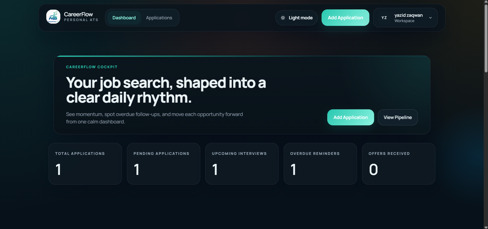

# CareerFlow ATS

CareerFlow ATS is a personal applicant tracking system built with Laravel for job seekers who want a cleaner and more structured alternative to spreadsheets, notes, and scattered reminders.

It helps users manage applications, track interview progress, monitor salary expectations, and stay on top of follow-ups through one focused dashboard.

## Recruiter Snapshot

- Full-stack Laravel product with real user workflows, not just basic CRUD
- Demonstrates authentication, relational modeling, validation, authorization, analytics, and deployment readiness
- Built with product-focused UI polish, responsive design, and dark mode support
- Includes automated tests for core user flows

## Quick Highlights

- Problem solved: personal job tracking is usually messy, manual, and easy to lose track of
- Product direction: one calm workspace for applications, interviews, reminders, and salary insight
- Strongest engineering areas: ownership rules, dashboard aggregation, reusable Blade components, and clean Laravel structure
- Portfolio value: shows both technical depth and practical product thinking

## Tech Summary

- Backend: PHP 8.3, Laravel 13
- Frontend: Blade, Tailwind CSS, Alpine.js, Vite
- Database: SQLite for local development
- Testing: PHPUnit
- Deployment-ready setup: Docker, Render-friendly configuration

## Project Preview

Add screenshots here later to make the repository more attractive for recruiters and hiring managers.

Suggested preview slots:

- Login page
- Dashboard overview
- Applications list with filters
- Create application form
- Application detail page
- Reminder and interview sections
- Status history timeline
- Dark mode view

### Login Page

The login experience is designed to feel calm, modern, and product-focused rather than default framework scaffolding.



Image path: `docs/screenshots/login-page.png`

### Dashboard Overview

Use this section to show the main workspace, KPI cards, reminders, interviews, and analytics at a glance.



Image path: `docs/screenshots/dashboard-overview.png`

### Applications List

Use this section to highlight filtering, search, status visibility, salary columns, and action controls.



Image path: `docs/screenshots/applications-list.png`

### Create Application Form

Use this section to show the form design, field structure, and overall data-entry experience.



Image path: `docs/screenshots/create-application-form.png`

### Application Detail

Use this section to show the deeper workflow view, including interviews, reminders, and status history.



Image path: `docs/screenshots/application-detail.png`

### Reminder and Interview Sections

Use this section to highlight the workflow support features inside the application detail page.



Image path: `docs/screenshots/reminder-interview-sections.png`

### Status History Timeline

Use this section to show how application progress and updates are tracked over time.



Image path: `docs/screenshots/status-history-timeline.png`

### Dark Mode

Use this section to show the visual polish and theming support of the interface.



Image path: `docs/screenshots/dark-mode.png`

Markdown base you can reuse:

```md
### Login Page


### Dashboard Overview


### Applications List


### Create Application Form


### Application Detail


### Reminder and Interview Sections


### Status History Timeline


### Dark Mode

```

Recommended folder:

- `docs/screenshots/`

## Why This Project Stands Out

- Solves a real workflow problem with practical day-to-day value
- Designed as a complete product, not just a CRUD exercise
- Shows ownership rules, relational data modeling, dashboard reporting, and polished UI work
- Demonstrates both backend structure and frontend product thinking
- Includes automated tests for core business flows

## What It Does

CareerFlow gives each user a private workspace to:

- create and manage job applications
- track statuses across the hiring pipeline
- record interview rounds and outcomes
- schedule reminders and follow-ups
- review salary trends and offer data
- monitor recent activity and momentum from a dashboard
- export filtered application data to CSV

## Core Features

- Secure authentication with Laravel Breeze
- Application CRUD with user ownership protection
- Search and filter by company, role, and status
- Interview tracking with editable entries
- Reminder scheduling, completion, and cleanup
- Status history timeline with optional notes
- Dashboard insights for overdue reminders and upcoming interviews
- Status distribution and monthly activity visual summaries
- Salary snapshot for expected and offered compensation
- Success and confirmation modal flows for key actions
- Responsive UI with light and dark mode support

## Tech Stack

- Backend: PHP 8.3, Laravel 13
- Frontend: Blade, Tailwind CSS, Alpine.js, Vite
- Database: SQLite for local development
- Testing: PHPUnit
- Deployment-ready setup: Docker, Render-friendly configuration

## Engineering Highlights

This project was built to demonstrate more than interface design.

Key technical areas include:

- layered Laravel MVC structure
- request validation with user-friendly error messaging
- record ownership enforcement through policies and scoped queries
- relational schema design for applications, interviews, reminders, and history
- reusable Blade layouts and components
- dashboard aggregation logic for user-specific analytics
- production considerations such as environment separation and deployment setup

## Main Entities

- `users`
- `companies`
- `applications`
- `interviews`
- `reminders`
- `application_status_histories`

Main relationships:

- one user has many applications
- one company has many applications
- one application has many interviews
- one application has many reminders
- one application has many status history entries

## Main Screens

- Authentication flow
- Dashboard overview
- Applications list and filters
- Create and edit application form
- Application detail page
- Interview and reminder management
- Profile settings

## Product Focus

The product direction behind CareerFlow is simple:

- reduce friction in personal job tracking
- make follow-up actions easy to see
- turn scattered progress into a clear workflow
- balance practical usability with portfolio-level polish

## Testing Coverage

Automated tests cover the most important user flows, including:

- authentication
- registration
- password reset
- application CRUD
- ownership checks
- interview management
- reminder management
- dashboard analytics
- CSV export

Run the test suite with:

```bash
php artisan test
```

## Local Setup

### 1. Install dependencies

```bash
composer install
npm install
```

### 2. Create environment file

```bash
copy .env.example .env
php artisan key:generate
```

### 3. Configure the local database

This project uses SQLite locally.

Local database file:

- `storage/private/careerflow.sqlite`

### 4. Run migrations and seed demo data

```bash
php artisan migrate
php artisan db:seed
```

### 5. Start the app

Terminal 1:

```bash
php -S 127.0.0.1:8080 -t public
```

Terminal 2:

```bash
npm run dev
```

Then open:

- `http://127.0.0.1:8080`

## Demo Data

Seeded portfolio data is available for local demonstration.

- Email: `demo@careerflow.test`
- Password: `password`

## Email Setup

### Local development

For local testing, mail is logged instead of sent:

```bash
MAIL_MAILER=log
```

Password reset emails can then be reviewed in:

- `storage/logs/laravel.log`

### Production

For hosted deployment, the recommended setup uses Resend.

Required production environment values:

```bash
APP_URL=https://your-domain.com
MAIL_MAILER=resend
RESEND_API_KEY=re_xxxxxxxxxxxxxxxxx
MAIL_FROM_ADDRESS=noreply@your-domain.com
MAIL_FROM_NAME="CareerFlow ATS"
```

After updating production mail configuration:

```bash
php artisan config:clear
```

## Deployment Notes

This repository includes deployment support for hosted environments such as Render.

Supporting files include:

- `Dockerfile`
- `.env.production.example`
- `DEPLOYMENT.md`

For a portfolio deployment, use:

- a hosted PostgreSQL database
- proper production environment variables
- HTTPS-enabled hosting

## Suggested Portfolio Screenshots

If you want to present this project to recruiters or hiring managers, the most valuable screenshots are:

- login page
- dashboard overview
- applications list with filters
- create application form
- application detail page
- reminder and interview sections
- status history timeline
- dark mode view

## Future Improvements

- dedicated reports page
- richer filtering by date and salary range
- recruiter or contact management
- saved filter presets
- file attachments for resumes or cover letters
- email or in-app reminder notifications
- richer chart components

## What This Project Demonstrates

For hiring teams, CareerFlow ATS demonstrates:

- ability to turn a real-world problem into a usable product
- thoughtful backend structure in Laravel
- clean relational database design
- full-stack problem solving across UI, business logic, and data
- attention to user experience, not only code correctness
- persistence in carrying a project through implementation, testing, and deployment preparation

## Notes

This repository is intended for portfolio and learning presentation.

Sensitive production secrets are not stored in version control. Use environment variables for all deployment credentials and service keys.
